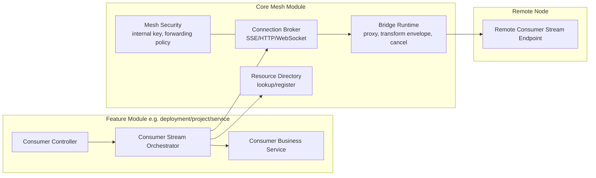
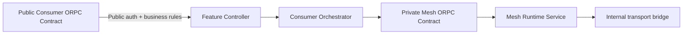
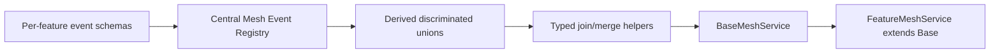
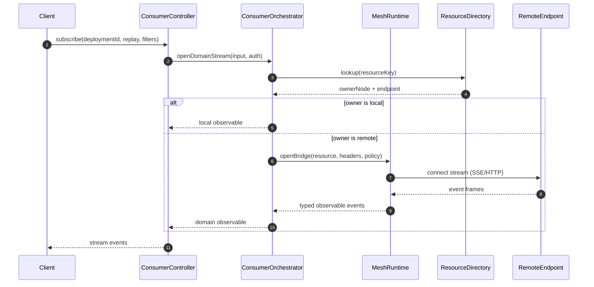
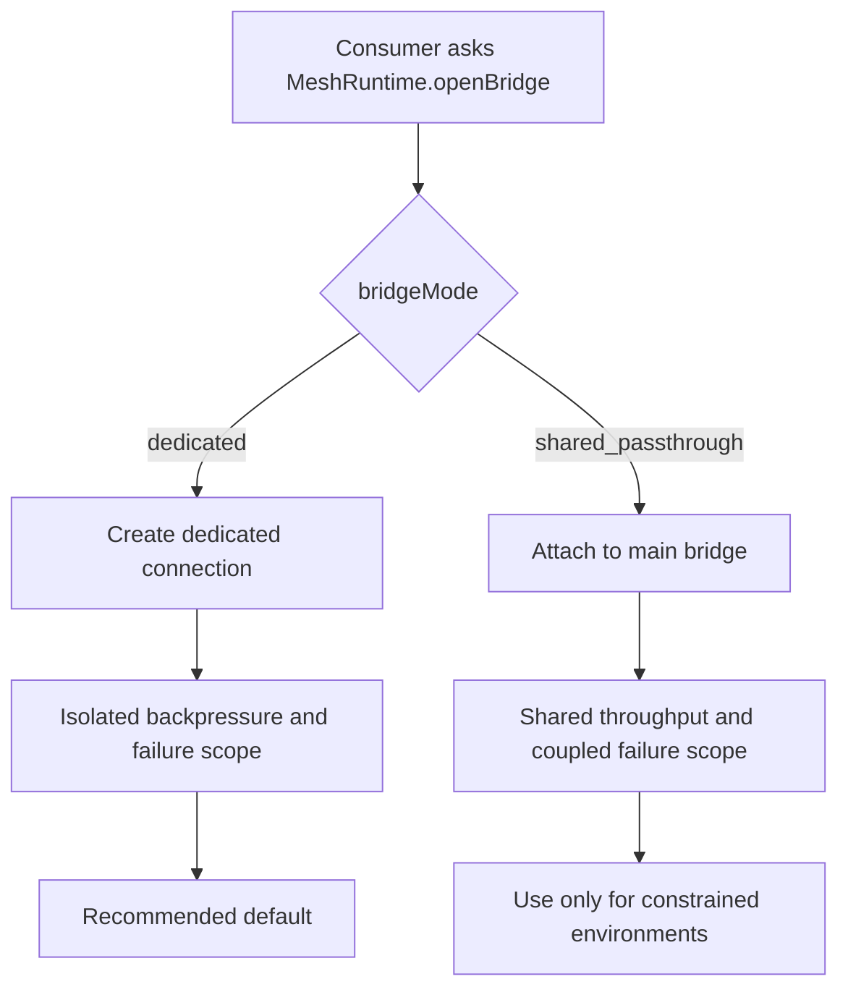
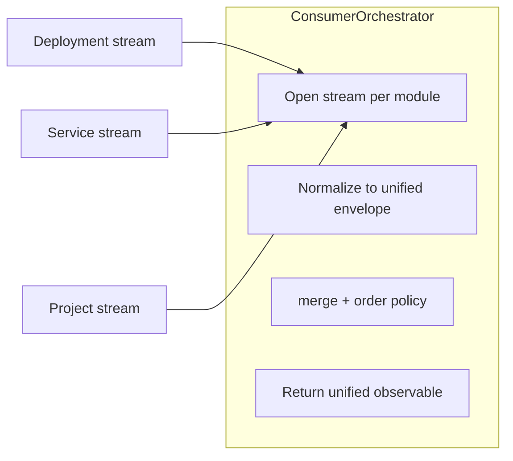
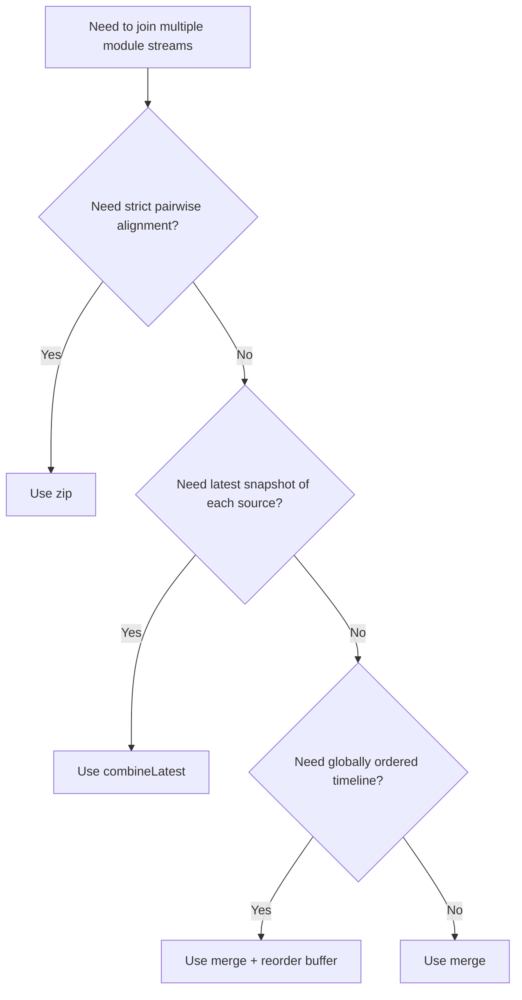

<DocMeta source="apps/api + apps/doc architecture guidance" scope="v3" />

## Why this pattern exists

When stream/event features grow, mesh code often drifts into business concerns (deployment lifecycle, domain rules, retries, ownership semantics). That coupling makes everything harder to evolve.

This pattern enforces one clean rule:

<DocCallout title="Single responsibility split" tone="success">
Mesh handles network/runtime concerns (where things live, how to connect, how to bridge). Consumer modules handle business concerns (what events mean, what to do with them, invariants and permissions).
</DocCallout>

## Design goals

- Mesh remains a reusable platform capability.
- Feature modules keep autonomy over their domain semantics.
- Contracts are explicit, typed, and stable.
- Streaming paths support both local and remote ownership transparently.
- New bridge modes (public endpoint, internal bridge, fan-out) can be added without rewriting feature business logic.
- Multiple domain streams can be joined safely into one typed consumer stream.

## Architecture at a glance



## Contract-first strategy

Use two contract families with strict ownership boundaries:

### 1) Consumer contracts (business-facing)

Owned by feature modules (deployment, project, service, etc.):

- Input/output schemas for domain events
- Replay semantics and query filters meaningful to that domain
- Authorization and business constraints

### 2) Mesh runtime contracts (platform-facing)

Owned by mesh core module:

- resource registration/lookup
- connection/bridge lifecycle
- transport options (SSE, HTTP stream, websocket)
- bridge policy and health metadata

These contracts are **private ORPC contracts** (control-plane only):

- implemented with ORPC under the hood
- not exposed as public internet endpoints
- callable only by trusted internal actors (mesh services, orchestrators, workers)

<DocCallout title="Boundary rule" tone="warning">
Consumer contracts must never expose mesh internals as business API. Mesh contracts must never encode domain-specific business rules.
</DocCallout>

## Private ORPC for mesh internal/control-plane traffic

All mesh-control and internal bridge operations must use ORPC, but through a **private contract family** separate from public business contracts.



### Security requirements (concrete)

- Private mesh ORPC router is mounted on an internal-only path/network segment (never public ingress).
- Enforce strong service identity on every call (mTLS and/or signed service token with short TTL).
- Validate caller audience/role (e.g., `mesh:control`, `mesh:bridge`, `worker:queue`) via dedicated internal auth middleware.
- Apply strict contract-level authorization per operation (`openInternalBridge`, `joinBridges`, `closeBridge`, etc.).
- Forwarded user auth context must be explicit, minimal, and signed; never trust arbitrary passthrough headers.
- Disable browser/session auth for private router surface; only service credentials are accepted.

```ts
// apps/api/src/core/modules/mesh/contracts/private/mesh-runtime.private.router.ts
export const meshRuntimePrivateContract = oc.router({
  openInternalBridge: meshOpenInternalBridgeContract,
  joinBridges: meshJoinBridgesContract,
  closeBridge: meshCloseBridgeContract,
});

// all handlers must use internal mesh auth middleware (not public user auth)
// implement(meshRuntimePrivateContract.openInternalBridge).use(requireMeshServiceAuth())
```

<DocCallout title="Hard rule" tone="warning">
Even when traffic is internal, do not bypass ORPC contracts with ad-hoc HTTP handlers. Internal mesh/control paths remain contract-first, typed, and authenticated.
</DocCallout>

## Schema-first mesh event model (DX + production pattern)

> **Added**: 2026-03-23  
> **Type**: Pattern  
> **Confidence**: Verified ✅  
> **Scope**: v3

### Summary

Define every mesh/internal event as a zod schema first, aggregate all event schemas in one registry, and derive typed unions/helpers from that registry for safe join/merge operations.

### Context

Without a single schema source, stream composition drifts into weakly typed `unknown` payloads. A centralized registry gives one contract vocabulary for validation, routing, filtering, and fan-in.

### Pattern architecture



### 1) Define event schemas per module

```ts
// apps/api/src/core/modules/mesh/schemas/events/deployment.events.ts
import { z } from "zod/v4";

export const deploymentQueuedSchema = z.object({
  type: z.literal("deployment.queued"),
  deploymentId: z.string(),
  at: z.string(),
});

export const deploymentStartedSchema = z.object({
  type: z.literal("deployment.started"),
  deploymentId: z.string(),
  at: z.string(),
});
```

### 2) Aggregate once in a central registry

```ts
// apps/api/src/core/modules/mesh/schemas/events/registry.ts
import { z } from "zod/v4";
import { deploymentQueuedSchema, deploymentStartedSchema } from "./deployment.events";
import { serviceHealthChangedSchema } from "./service.events";

export const meshEventRegistry = {
  deploymentQueued: deploymentQueuedSchema,
  deploymentStarted: deploymentStartedSchema,
  serviceHealthChanged: serviceHealthChangedSchema,
} as const;

export type MeshEventRegistry = typeof meshEventRegistry;
export type MeshEventKey = keyof MeshEventRegistry;

export const meshEventUnionSchema = z.discriminatedUnion("type", [
  ...Object.values(meshEventRegistry),
]);

export type MeshEvent = z.infer<typeof meshEventUnionSchema>;
```

### 3) Wrap with a typed envelope schema

```ts
// apps/api/src/core/modules/mesh/schemas/events/envelope.ts
import { z } from "zod/v4";
import { meshEventUnionSchema } from "./registry";

export const meshEnvelopeSchema = z.object({
  stream: z.string(),
  sourceModule: z.enum(["deployment", "service", "project", "system"]),
  sequence: z.number().int().nonnegative(),
  emittedAt: z.string(),
  event: meshEventUnionSchema,
});

export type MeshEnvelope = z.infer<typeof meshEnvelopeSchema>;
```

### 4) Create typed join helpers from the registry

```ts
// apps/api/src/core/modules/mesh/services/event-join.helpers.ts
import { z } from "zod/v4";
import type { Observable } from "rxjs";
import { merge } from "rxjs";
import type { MeshEnvelope } from "../schemas/events/envelope";
import type { MeshEventKey, MeshEventRegistry } from "../schemas/events/registry";

type EventByKey<K extends MeshEventKey> = z.infer<MeshEventRegistry[K]>;
type EnvelopeByKey<K extends MeshEventKey> = MeshEnvelope & { event: EventByKey<K> };

export function mergeByEventKeys<const K extends readonly MeshEventKey[]>(
  streams: { [P in K[number]]: Observable<EnvelopeByKey<P>> },
): Observable<EnvelopeByKey<K[number]>> {
  return merge(...Object.values(streams));
}
```

### 5) Base service for all mesh actions

```ts
// apps/api/src/core/modules/mesh/services/base-mesh.service.ts
import { Injectable } from "@nestjs/common";
import type { Observable } from "rxjs";
import { map } from "rxjs/operators";
import type { ZodTypeAny, z } from "zod/v4";
import { meshEnvelopeSchema, type MeshEnvelope } from "../schemas/events/envelope";

@Injectable()
export abstract class BaseMeshService {
  protected constructor(protected readonly runtime: MeshStreamRuntimeService) {}

  protected openInternalTypedStream<TSchema extends ZodTypeAny>(
    input: MeshOpenBridgeInput,
    headers: Headers,
    payloadSchema: TSchema,
  ): Observable<MeshEnvelope & { event: z.infer<TSchema> }> {
    return this.runtime.openBridge<unknown>(input, headers).pipe(
      map((raw) => meshEnvelopeSchema.parse(raw)),
      map((envelope) => ({
        ...envelope,
        event: payloadSchema.parse(envelope.event),
      })),
    );
  }
}
```

### 6) Feature service extends base service (business aware)

```ts
// apps/api/src/modules/deployment/mesh/deployment-mesh.service.ts
@Injectable()
export class DeploymentMeshService extends BaseMeshService {
  streamDeploymentSignals(input: { deploymentId: string; headers: Headers }) {
    return this.openInternalTypedStream(
      {
        resourceKind: "stream",
        resourceKey: `stream:deployment:${input.deploymentId}`,
        transport: "sse",
        bridgeMode: "dedicated",
        query: {},
        forwardAuth: true,
      },
      input.headers,
      meshEventRegistry.deploymentStarted,
    );
  }
}
```

### Production checklist for this pattern

<DocChecklist
  items={[
    { label: 'Every internal mesh event has a zod schema (no untyped payloads)', done: false },
    { label: 'Registry is the single source of truth for event shape + key', done: false },
    { label: 'Envelope schema validates transport payload before business use', done: false },
    { label: 'All internal bridge/control calls go through private ORPC contracts', done: false },
    { label: 'All internal mesh handlers use requireInternalMesh() middleware', done: false },
    { label: 'Signed mesh token path (verifyMeshToken) is enabled in strict mode where possible', done: false },
    { label: 'Feature mesh services extend BaseMeshService rather than re-implementing transport logic', done: false },
  ]}
/>

## Recommended service pattern

Define three service roles:

1. **ConsumerStreamOrchestrator** (feature module)
   - decides whether stream is local or remote
   - asks mesh for a stream channel when remote
   - merges replay/filter business rules with domain semantics

2. **MeshStreamRuntimeService** (core mesh module)
   - discovers owner node/resource
   - opens transport (SSE/HTTP stream/WebSocket)
   - returns typed observable stream with cancellation and error propagation

3. **DomainBusinessService** (feature module)
   - interprets domain events
   - performs state transitions, policy checks, side effects

## Concrete code example

The example below shows the exact boundary split:

- deployment module owns domain contracts and business orchestration
- mesh core owns discovery + transport bridge
- controller stays thin and transport-agnostic

### 1) Consumer contract (business-facing)

```ts
// packages/contracts/api/modules/deployment/stream.ts
import { z } from "zod/v4";
import { standard } from "@repo/orpc-utils";
import { deploymentEventSchema } from "@repo/api-contracts/common/deployment";

const deploymentOps = standard.zod(z.object({ id: z.string() }), "deployment");

export const deploymentStreamContract = deploymentOps
  .findById()
  .input((b) =>
    b.query(
      z.object({
        replay: z.boolean().default(false),
        replayLimit: z.number().int().min(1).max(500).default(100),
      }),
    ),
  )
  .output((b) => b.observable(deploymentEventSchema))
  .build();
```

### 2) Mesh runtime contract (platform-facing)

```ts
// apps/api/src/core/modules/mesh/contracts/mesh-stream-runtime.contract.ts
import { z } from "zod/v4";

export const meshOpenBridgeInputSchema = z.object({
  resourceKind: z.literal("stream"),
  resourceKey: z.string(),
  transport: z.enum(["sse", "http-stream", "websocket"]).default("sse"),
  bridgeMode: z.enum(["dedicated", "shared_passthrough"]).default("dedicated"),
  query: z.record(z.string(), z.string()).default({}),
  forwardAuth: z.boolean().default(true),
});

export const meshBridgeEnvelopeSchema = z.object({
  at: z.string(),
  data: z.unknown(),
});

export type MeshOpenBridgeInput = z.infer<typeof meshOpenBridgeInputSchema>;
```

### 3) Mesh runtime service (core transport concern only)

```ts
// apps/api/src/core/modules/mesh/services/mesh-stream-runtime.service.ts
import { Injectable } from "@nestjs/common";
import { Observable } from "rxjs";

@Injectable()
export class MeshStreamRuntimeService {
  openBridge<TEvent>(input: MeshOpenBridgeInput, headers: Headers): Observable<TEvent> {
    // 1) lookup resource owner in mesh directory
    // 2) connect over selected transport
    // 3) parse frames + map envelope -> TEvent
    // 4) propagate cancellation/errors
    // (implementation intentionally runtime-focused, no business branching)
    return new Observable<TEvent>();
  }
}
```

### 4) Consumer orchestrator (feature business orchestration)

```ts
// apps/api/src/modules/deployment/application/deployment-stream.orchestrator.ts
import { Injectable } from "@nestjs/common";
import { Observable } from "rxjs";

@Injectable()
export class DeploymentStreamOrchestrator {
  constructor(
    private readonly deploymentService: DeploymentService,
    private readonly meshRuntime: MeshStreamRuntimeService,
    private readonly meshTopology: SystemMeshTopologyService,
  ) {}

  openStream(input: {
    deploymentId: string;
    replay: boolean;
    replayLimit: number;
    headers: Headers;
  }): Observable<DeploymentStreamEvent> {
    const key = `stream:deployment:${input.deploymentId}`;
    const lookup = this.meshTopology.lookupResource({
      kind: "stream",
      key,
      includeCandidates: true,
    });

    const owner = lookup.primary;
    const localNodeId = this.meshTopology.getLocalNode().nodeId;

    if (!owner || owner.ownerNodeId === localNodeId) {
      // local ownership => business service decides event semantics
      return this.deploymentService.streamDeploymentEvents({
        deploymentId: input.deploymentId,
        replay: input.replay,
        replayLimit: input.replayLimit,
      });
    }

    // remote ownership => ask mesh runtime for bridge (transport concern)
    return this.meshRuntime.openBridge<DeploymentStreamEvent>(
      {
        resourceKind: "stream",
        resourceKey: key,
        transport: "sse",
        bridgeMode: "dedicated",
        query: {
          replay: String(input.replay),
          replayLimit: String(input.replayLimit),
        },
        forwardAuth: true,
      },
      input.headers,
    );
  }
}
```

### 5) Thin controller (no mesh transport implementation details)

```ts
// apps/api/src/modules/deployment/controllers/deployment.controller.ts
@Implement(appContract.deployment.stream)
stream() {
  return implement(appContract.deployment.stream)
    .use(requireAuth())
    .handler(({ input, context }) => {
      return this.deploymentStreamOrchestrator.openStream({
        deploymentId: input.params.id,
        replay: input.query.replay,
        replayLimit: input.query.replayLimit,
        headers: this.buildProxyHeaders(context),
      });
    });
}
```

<DocCallout title="Concrete boundary check" tone="success">
If you can delete/replace the mesh transport implementation without touching domain semantics, your boundary is correct.
</DocCallout>

## End-to-end stream lifecycle



## Bridge mode policy (recommended)

`openBridge(...)` should support two explicit modes:

- **`dedicated`** (recommended): opens a fresh transport connection for this consumer stream
- **`shared_passthrough`** (allowed, discouraged): reuses an existing main bridge and passes through frames



<DocCallout title="Why shared passthrough is discouraged" tone="warning">
`shared_passthrough` couples unrelated consumers to one transport lifecycle (backpressure, reconnect storms, and failure blast radius). Keep it as an explicit opt-in, never as default.
</DocCallout>

## Multi-module stream join pattern

When a consumer needs one stream composed from multiple modules (for example deployment + service + project), keep joining logic in a **consumer orchestrator**, not in mesh runtime.



```ts
// apps/api/src/modules/deployment/application/unified-activity.orchestrator.ts
import { Injectable } from "@nestjs/common";
import { merge, Observable } from "rxjs";
import { map } from "rxjs/operators";

type UnifiedActivityEvent = {
  source: "deployment" | "service" | "project";
  at: string;
  data: unknown;
};

@Injectable()
export class UnifiedActivityOrchestrator {
  constructor(
    private readonly deploymentOrchestrator: DeploymentStreamOrchestrator,
    private readonly serviceOrchestrator: ServiceStreamOrchestrator,
    private readonly projectOrchestrator: ProjectStreamOrchestrator,
  ) {}

  openUnifiedActivity(input: {
    deploymentId: string;
    serviceId: string;
    projectId: string;
    headers: Headers;
  }): Observable<UnifiedActivityEvent> {
    const deployment$ = this.deploymentOrchestrator
      .openStream({ deploymentId: input.deploymentId, replay: false, replayLimit: 100, headers: input.headers })
      .pipe(map((data) => ({ source: "deployment" as const, at: new Date().toISOString(), data })));

    const service$ = this.serviceOrchestrator
      .openStream({ serviceId: input.serviceId, replay: false, replayLimit: 100, headers: input.headers })
      .pipe(map((data) => ({ source: "service" as const, at: new Date().toISOString(), data })));

    const project$ = this.projectOrchestrator
      .openStream({ projectId: input.projectId, replay: false, replayLimit: 100, headers: input.headers })
      .pipe(map((data) => ({ source: "project" as const, at: new Date().toISOString(), data })));

    return merge(deployment$, service$, project$);
  }
}
```

### Stream join policy matrix

Use the join operator based on semantics, not convenience:

| Policy | RxJS primitive | Best for | Trade-offs | Recommended default? |
|---|---|---|---|---|
| First-available interleaving | `merge(...)` | Real-time activity feeds from many modules | Event order is per-source arrival, not global causal order | ✅ Yes |
| Latest-state composition | `combineLatest(...)` | Dashboard state cards that need "latest of each stream" | No emission until each source emits once; chatty when many sources update | ⚠️ Case-by-case |
| Lockstep pairing | `zip(...)` | Strictly paired pipelines (A event must pair with B event) | Can stall if one source lags; not suitable for unbalanced event rates | ❌ Rare |
| Global time ordering | `merge(...) + reorder buffer` | Audit timelines needing near-ordered output | Added latency + buffering complexity; clock skew risk | ⚠️ Use only when required |
| Controlled fan-in with limits | `mergeMap(..., concurrency)` | Dynamic N-stream joins with bounded resource usage | Requires lifecycle management per child stream | ✅ For dynamic sources |



<DocCallout title="Recommended baseline" tone="success">
Start with `merge(...)` for cross-module activity streams. Add ordering buffers or snapshot joins only when product requirements explicitly demand them.
</DocCallout>

```ts
// Optional ordered merge sketch for audit-like timelines
const ordered$ = merge(deployment$, service$, project$).pipe(
  // 1) bucket by small window (e.g. 250ms)
  // 2) sort by event.at then deterministic tiebreaker
  // 3) emit in order
);
```

## Capability model for “new bridge” features

Mesh runtime should expose a capability-oriented API (not domain-specific methods):

- `openBridge(...)`
- `openPublicStreamEndpoint(...)`
- `openInternalBridge(...)`
- `joinBridges(...)` (transport-level fan-in only, no domain semantics)
- `closeBridge(...)`
- `inspectBridgeHealth(...)`

Consumer orchestrators compose these capabilities with domain behavior rather than embedding connection logic in controllers.

## What changes in controllers

Controllers stay thin:

- validate contract input
- call `ConsumerStreamOrchestrator`
- return observable

No raw stream parsing, no protocol details, no resource-directory mutation logic in controllers.

## Anti-patterns to avoid

- Parsing SSE frames directly in feature controllers.
- Embedding domain decisions into mesh runtime (e.g., deployment status transitions in mesh).
- Leaking mesh resource keys or node topology into public business contracts.
- Duplicating connection/abort/error logic per feature.
- Exposing private mesh control endpoints on public ingress.
- Implementing internal bridge/control calls with raw HTTP handlers instead of private ORPC contracts.

## Migration path (incremental)

1. Extract stream transport/proxy code into `core/modules/mesh` runtime service.
2. Keep existing feature contracts unchanged.
3. Introduce feature-level orchestrator services calling mesh runtime.
4. Move controller logic to orchestrators.
5. Add mesh runtime tests (connection lifecycle, fallback, cancellation).
6. Add feature tests for business semantics independent from transport.

## Definition of done for this pattern

- Mesh owns discovery + connection + bridge lifecycle.
- Feature modules own business semantics and typed domain orchestration.
- Contracts are split by concern (consumer vs runtime).
- Controllers are thin and transport-agnostic.
- Stream behavior is testable independently at both runtime and business layers.
