> **Added**: 2026-03-16  
> **Type**: Reference  
> **Confidence**: Verified ✅  
> **Scope**: v3 target architecture

This page gives a graph-first blueprint of the platform: capabilities, domain/module hierarchy, runtime flow, environment model, dependencies, and role-based usage.

---

## 1) Capability map (what the application should be capable of)

```mermaid
flowchart TD
    A[Universal Deployment Platform]

    A --> B[Identity & Access]
    A --> C[Project & Service Management]
    A --> D[Deploy Engine]
    A --> E[Source Providers
    A --> F[Networking & Domains]
    A --> G[Container & Runtime Ops]
    A --> H[Observability]
    A --> I[Orchestration]
    A --> J[Storage & Registry]

    B --> B1[Auth + Sessions]
    B --> B2[Org + Roles + Permissions]

    C --> C1[Projects]
    C --> C2[Services]
    C --> C3[Environment Variables]

    D --> D1[Queue + Workers]
    D --> D2[Build + Runtime Apply]
    D --> D3[Rollback + Retry + Cancel]

    E --> E1[GitHub]
    E --> E2[GitLab / Gitea]
    E --> E3[Upload / Archive]
    E --> E4[Prebuilt Image]

    F --> F1[Traefik Dynamic Routes]
    F --> F2[Domain Mapping]
    F --> F3[TLS / Certificates]

    G --> G1[Container Lifecycle]
    G --> G2[Exec / Logs / Files]
    G --> G3[Compose Stacks]

    H --> H1[Deployment Events]
    H --> H2[Metrics + Health]
    H --> H3[Alerts]

    I --> I1[Service DAG]
    I --> I2[Fleet Rollouts]
    I --> I3[Drift Reconciliation]

    J --> J1[File Storage]
    J --> J2[Image Registry]
```

### Target outcome

- One platform handling Git-based deploys, upload-based deploys, and image-based deploys.
- Zero manual reverse-proxy edits: routes/certs are generated/synced by platform logic.
- Cluster-aware behavior via mesh services and event replication.

---

## 2) How it should work (end-to-end runtime flow)

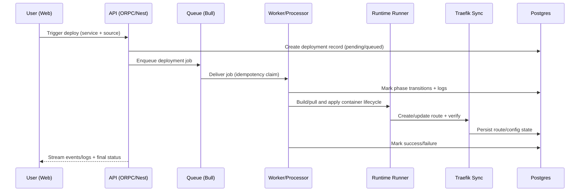

---

## 3) Domain and module hierarchy

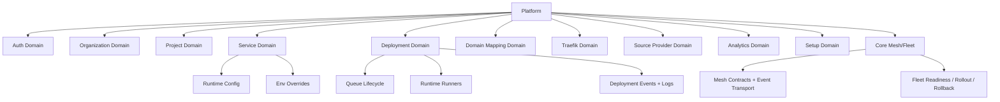

### API contract surface (current v3 contract assembly)

- `user`, `health`, `push`, `test`
- `domain`, `project`, `service`, `deployment`, `analytics`
- `providerSchema`, `template`, `setup`
- `core.mesh`, `core.fleet`
- `organization.admin.listAll`, `organization.admin.listMembers`

---

## 4) Business hierarchy (who owns what)

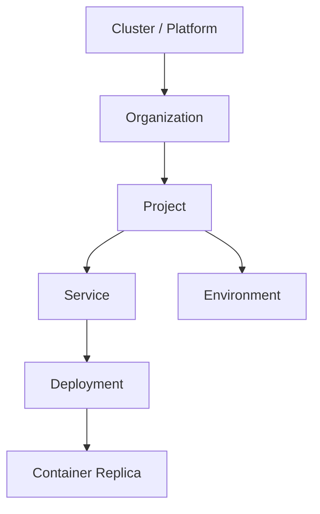

This is the operational chain used by permission checks, deployment flow, and monitoring aggregation.

---

## 5) Environment variables model

### Grouped model (from `.env.template`)

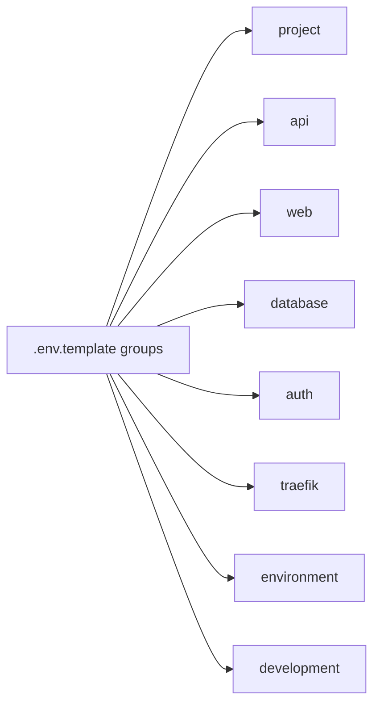

### Runtime precedence model

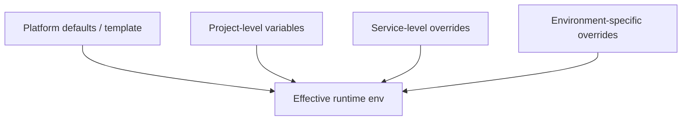

### High-signal variables to know

- Core/runtime: `DATABASE_URL`, `NODE_ENV`, `NEXT_PUBLIC_API_URL`, `API_PORT`
- Auth/bootstrap: `AUTH_SECRET`, `DEFAULT_ADMIN_EMAIL`, `DEFAULT_ADMIN_PASSWORD`, `DEV_AUTH_KEY`
- Mesh/cluster: `MESH_CLUSTER_ID`, `MESH_NODE_ID`, `MESH_STREAM_SHARED_SECRET`
- Source/webhook: `GITHUB_WEBHOOK_SECRET`
- API ops: `API_ADMIN_TOKEN`, `UPLOADS_DIR`
- LB/edge (prod-like): `LB_ROUTE_SECRET`, `LB_FORWARD_TOKEN_SECRET`, `LB_DIAGNOSTIC_SECRET`

---

## 6) Dependency graph (technical stack)

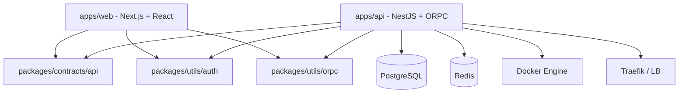

---

## 7) Roles, setup, and usage

### 7.1 Role hierarchy

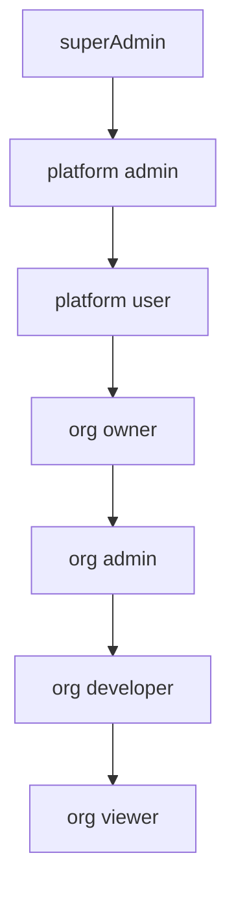

- `superAdmin`: bypass-level platform control.
- Org scope is role/rule-based (resource rules and cascades).

### 7.2 First-time setup flow

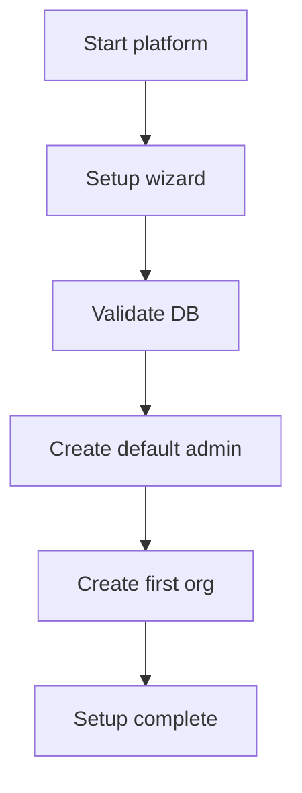

### 7.3 Typical daily usage flow

```mermaid
flowchart LR
    U1[Choose org/project] --> U2[Configure service + env]
    U2 --> U3[Choose source (git/upload/image)]
    U3 --> U4[Trigger deploy]
    U4 --> U5[Follow logs/events]
    U5 --> U6[Validate route/domain]
    U6 --> U7[Monitor + rollback if needed]
```

---

## 8) Special focus: manual upload deployment + Traefik sync

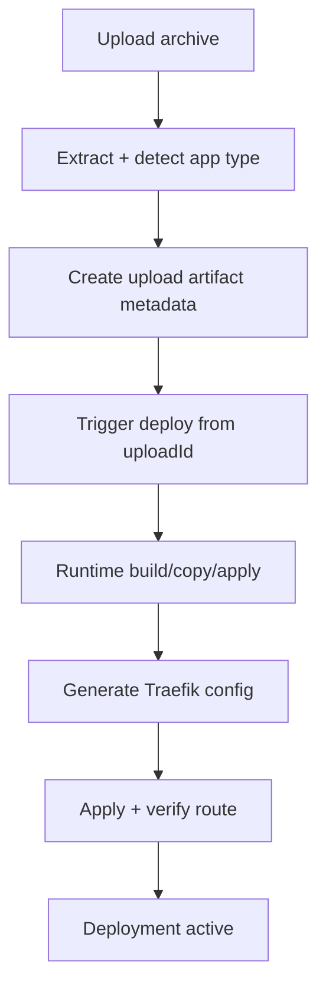

This is the exact value slice currently prioritized for implementation: upload-provider flow + reliable Traefik synchronization.

---

## 9) Mesh system, multi-instance connectivity, shared data, and request flow

### 9.1 Mesh topology (how multiple instances connect)

The platform mesh is node-based and cluster-scoped:

- Every API/LB instance has a unique `MESH_NODE_ID`.
- Nodes that share the same `MESH_CLUSTER_ID` belong to the same cluster.
- Inter-node transport uses ORPC EventIterator streams (HTTP/SSE), not a separate broker by default.
- Topology + sessions are tracked in mesh services (`SystemMeshTopologyService`, `BaseMeshService` pattern).

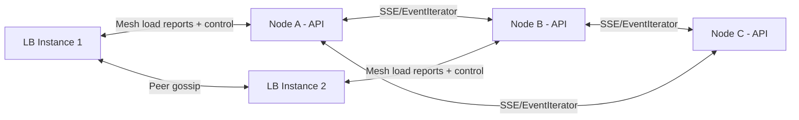

### 9.2 What is shared across nodes

Think in 3 categories:

1. **Persistent authoritative state** (DB-backed)  
   - deployments, services, domains, events, route config metadata
2. **Runtime mesh state** (in-memory + replicated envelopes)  
   - peer sessions, topology edges, stream/resource ownership, queue transition logs
3. **Fast routing state at LB layer** (in-memory + gossip)  
   - node load reports, stream ownership hints, dedupe windows, route token keyrings

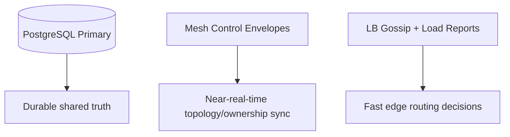

### 9.3 How running flows are reachable from any node

Goal: a user can hit any edge/API node and get any live realtime stream, while never getting direct access to internal raw stream keys.

Mechanism:

- Client calls a dedicated product realtime endpoint.
- Edge/API maps request context to internal stream ownership.
- Internal Node/LB resolves best owner via cluster load/ownership index.
- If selected owner is remote, instance-to-instance proxy/relay is used.
- User receives normalized SSE events for the requested domain stream; raw stream key routes remain internal-only.
- Route hint token keeps short-lived affinity; reconnect/fallback handles owner interruptions.

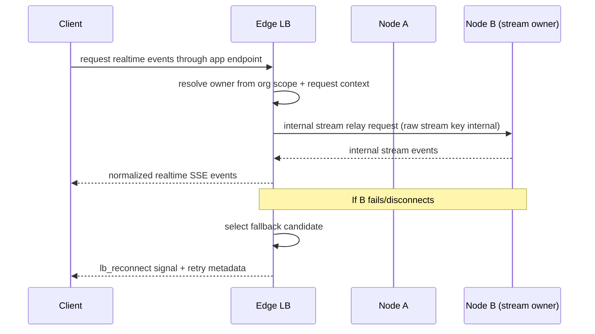

### 9.4 Queue/event propagation and consistency model

- Domain mesh services use correlation IDs and optional kill-switch propagation (`callMany` + cancel envelopes).
- Queue transitions can be appended locally and replicated as transition log entries.
- Idempotency keys prevent duplicate application when events are replayed/forwarded.
- Membership/topology can reconcile snapshots for anti-entropy.

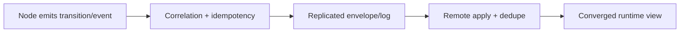

### 9.5 Higher load balancer request handling (global/edge behavior)

High-level LB instances sit above API nodes and do **adaptive routing**:

- ingest mesh load reports (`cpuUsage`, `memoryUsage`, `activeStreams`, `queueDepth`, `errorRate`)
- keep resource ownership hints (`isOwner`, `priority`)
- score candidates deterministically (load + ownership bonus + priority)
- sign/verify route-hint tokens (`LB_FORWARD_TOKEN_SECRET` + previous keys for rotation)
- gossip load reports to LB peers (`LB_PEER_URLS`) with dedupe TTL and hop limits

Candidate scoring shape used by the LB service is a weighted blend:

$$
score = 0.4(1-cpu)+0.2(1-mem)+0.15(1-streamPressure)+0.15(1-queuePressure)+0.1(1-errorRate)+ownerBonus+priorityBonus
$$

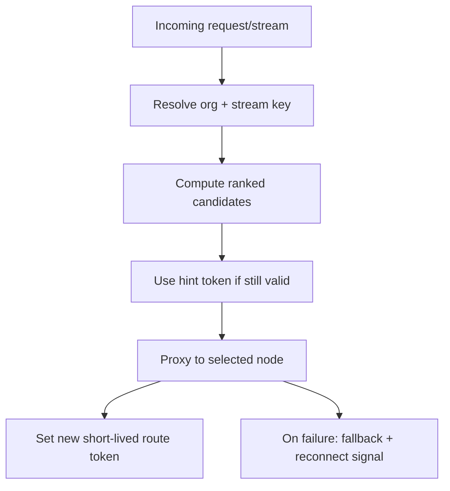

### 9.6 Required multi-instance configuration knobs

For API/LB instances to join and coordinate correctly:

- `MESH_CLUSTER_ID` (shared cluster identity)
- `MESH_NODE_ID` (unique per instance)
- `MESH_STREAM_SHARED_SECRET` (internal mesh stream trust)
- `LB_PEER_URLS` (comma-separated LB peers for gossip)
- `LB_ROUTE_SECRET` / `LB_FORWARD_TOKEN_SECRET` (+ previous key variants for rotation)
- `LB_LOCAL_UPSTREAM_URL` (self-upstream optimization when selected owner is local)
- report/routing tuning: `LB_REPORT_TTL_MS`, `LB_LOAD_REPORT_DEDUPE_TTL_MS`, `LB_LOAD_REPORT_MAX_HOPS`, `LB_ROUTE_KEYRING_REFRESH_MS`

This gives you a cluster where status flows are reachable from any node through dedicated business endpoints, data/state converge via mesh + DB, and internal stream internals stay private.

---

## Related references

- [`/docs/architecture/complete-feature-inventory`](/docs/architecture/complete-feature-inventory)
- [`/docs/architecture/platform-product-spec`](/docs/architecture/platform-product-spec)
- [`/docs/deployment/migration-task-breakdown`](/docs/deployment/migration-task-breakdown)